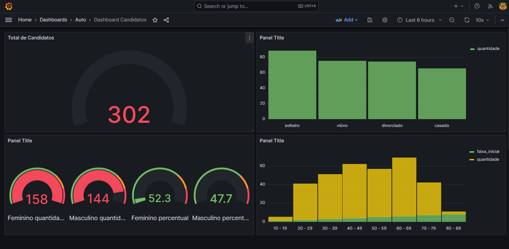

# grafana-sql

Projeto com PostgreSQL + Grafana



## 1️⃣ docker-compose.yml

```yaml
services:
  postgres:
    image: postgres:15
    container_name: postgres
    environment:
      POSTGRES_USER: admin
      POSTGRES_PASSWORD: admin
      POSTGRES_DB: app_db
    ports:
      - "5432:5432"
    volumes:
      - postgres_data:/var/lib/postgresql/data

  grafana:
    image: grafana/grafana:10.2.3
    container_name: grafana
    ports:
      - "3000:3000"
    depends_on:
      - postgres
    volumes:
      - grafana_data:/var/lib/grafana

volumes:
  postgres_data:
  grafana_data:
```

Suba tudo com:

```bash
docker compose up -d
```

---

## 2️⃣ Acessar o Grafana

* URL: **[http://localhost:3000](http://localhost:3000)**
* Login padrão:

  * **Usuário:** `admin`
  * **Senha:** `admin` (vai pedir pra trocar)

---

## 3️⃣ Conectar o PostgreSQL no Grafana

1. Vá em **Connections → Data sources**
2. Clique em **Add data source**
3. Escolha **PostgreSQL**
4. Preencha:

```
Host: postgres:5432
Database: app_db
User: admin
Password: admin
SSL Mode: disable
```

5. Clique em **Save & test**

✅ Se aparecer “Database Connection OK”, está tudo certo.

---

## 4️⃣ Exemplo de tabela no PostgreSQL

Suponha que você tenha uma tabela assim:

```sql
CREATE TABLE users (
  id SERIAL PRIMARY KEY,
  name TEXT,
  created_at TIMESTAMP DEFAULT now()
);
```

E alguns registros:

```sql
INSERT INTO users (name) VALUES ('Ana'), ('João'), ('Maria');
```

---

## 5️⃣ Mostrar quantidade de registros no Grafana

### Criar o painel

1. Vá em **Dashboards → New dashboard**
2. **Add a new panel**
3. Selecione o datasource **PostgreSQL**
4. Use essa query:

```sql
SELECT COUNT(*) FROM candidatos LIMIT 50;
```

5. Em **Visualization**, escolha:

   * **Stat** (fica ótimo pra contador)
6. Em **Value**, selecione:

   * `total_users`

💡 Resultado: um card mostrando **quantidade total de registros** 🎉

---

## 6️⃣ (Extra) Contagem ao longo do tempo

Se quiser ver crescimento:

```sql
SELECT
  created_at::date AS time,
  COUNT(*) AS total
FROM users
GROUP BY time
ORDER BY time;
```

E use visualização **Time series** 📈

---

Se quiser, posso:

* Criar um **init.sql** pra subir tabelas automaticamente
* Montar um **dashboard pronto**
* Ajudar a contar registros por status, tipo, usuário etc.

Só dizer 😄
