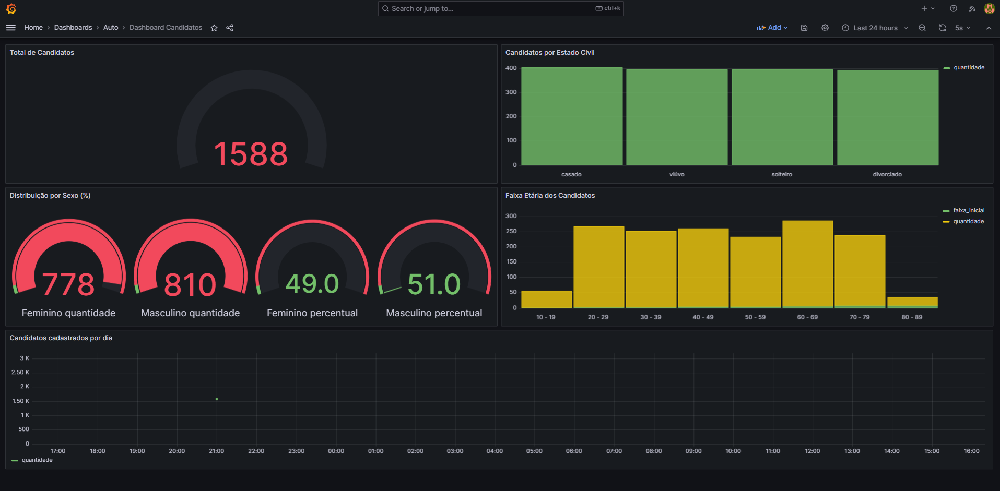

# 🏦 BANK — Plataforma de Admissão e Onboarding de Clientes

## Plataforma de Admissão e Onboarding de Clientes

Este repositório apresenta a **infraestrutura tecnológica para o processo de admissão de novos clientes em um sistema bancário**, contemplando desde o cadastro inicial de candidatos até a análise de conformidade e visualização de indicadores operacionais.

A solução foi projetada para simular um **fluxo real de onboarding bancário**, atendendo a requisitos comuns de validação cadastral, rastreabilidade e observabilidade.

---

## 1. Objetivo

Disponibilizar uma arquitetura de referência para:

* Cadastro e gerenciamento de **candidatos à abertura de conta**
* Validação inicial de dados cadastrais
* Persistência estruturada das informações
* Monitoramento e análise de indicadores do processo de admissão

---

## 2. Visão Geral da Arquitetura

A arquitetura é composta pelos seguintes componentes:

* **API Backend** desenvolvida em **Go**, utilizando o framework **GIN**
* **Banco de Dados PostgreSQL** para armazenamento relacional
* **Grafana** para visualização e monitoramento de métricas
* **Docker Compose** para orquestração da infraestrutura
* **Makefile** para padronização da operação do ambiente

Essa abordagem permite fácil replicação do ambiente, isolamento de responsabilidades e observabilidade do processo.

---

## 3. Estrutura do Repositório

```bash
.
├── BE                    # Backend (API Go)
│   ├── controllers       # Camada de controle
│   ├── models            # Modelos de domínio
│   ├── routes            # Definição de rotas
│   ├── db                # Conexão com o banco de dados
│   ├── CURL              # Exemplos de chamadas HTTP
│   ├── Dockerfile
│   └── main.go
├── FE                    # Frontend (documentação)
├── db
│   ├── docker-compose.yml
│   ├── init-db           # Scripts de inicialização do banco
│   ├── SQL
│   │   ├── CRUD          # Scripts Python para carga de dados
│   │   ├── querys        # Consultas analíticas
│   │   └── backup-dados  # Backups e procedimentos
│   └── grafana-provisioning
│       ├── dashboards
│       ├── datasources
│       └── alerting
├── docs                  # Documentação técnica
├── images                # Dashboards e evidências visuais
├── Makefile
└── README.md
```

---

## 4. Regras de Negócio

O processo de admissão segue regras básicas de conformidade e validação, típicas de ambientes regulados:

* **Validação de CPF** 

  O CPF do candidato deve estar em situação regular junto aos órgãos oficiais.

* **Análise de Documentação**

  A documentação enviada é submetida a verificação de integridade e conformidade.

* **Conformidade Fiscal**
  
  As validações seguem critérios compatíveis com registros da **Receita Federal**.

* **Controle de Status**

  * O indivíduo é registrado inicialmente como **Candidato**
  * A conversão para **Cliente** ocorre somente após aprovação nas validações

Essas regras garantem integridade do processo e rastreabilidade das decisões.

---

## 5. Monitoramento e Observabilidade

O **Grafana** é utilizado para acompanhamento operacional do processo de admissão, permitindo:

* Visualização do volume de candidatos
* Análise de status de validação
* Apoio à tomada de decisão operacional

### Dashboard de Candidatos



---

## 6. Execução do Ambiente

### 6.1 Pré-requisitos

* Docker Desktop
* Go
* Python 3
* Cliente de banco de dados (ex.: DBeaver)

---

### 6.2 Inicialização

O ambiente é gerenciado via **Makefile**.

```bash
make menu
```

---

### 6.3 Menu Operacional

```text
==============================
 Gerenciador Docker Compose
==============================
1) Subir ambiente
2) Remover ambiente
3) Reiniciar ambiente
0) Sair
------------------------------
Escolha uma opção:
```

---

## 7. Acesso ao Grafana

* **URL:** [http://localhost:3000](http://localhost:3000)
* **Credenciais padrão:**

  * Usuário: `admin`
  * Senha: `admin`
    *(Alteração obrigatória no primeiro acesso)*

### Dashboard

* [Candidatos](http://localhost:3000/d/dashboard-candidatos/dashboard-candidatos)

---

## 8. Carga Inicial de Dados

Para fins de teste e demonstração, existe um script de carga que insere **100 candidatos fictícios**.

```bash
python3 db/SQL/CRUD/create.py
```

✅ Inseridos 100 novos candidatos

---

## 9. Governança e Contribuições

Este projeto aceita contribuições seguindo boas práticas de versionamento e organização de código.

### Diretrizes

* Utilizar branches com prefixos: `feature/`, `fix/`, `docs/`
* Commits objetivos e descritivos
* Pull Requests devem conter descrição clara da alteração

### Processo

1. Fork do repositório
2. Criação de branch dedicada
3. Implementação da alteração
4. Abertura de Pull Request para revisão

---

## 10. Incidentes, Melhorias e Suporte

Problemas, sugestões ou melhorias devem ser reportados via **Issues**, garantindo rastreabilidade e histórico das decisões técnicas.

---